# 타이타닉 생존 예측하기


Kaggle에서 진행하는 오픈 데이터셋으로 타이타닉 생존자들의 데이터를 분석하고, 생존에 영향을 끼친 요인을 조사하는 프로젝트

https://www.kaggle.com/c/titanic/


시작하기 전에 column의 이름들을 미리 정리하자면

**pclass** : 티켓 클래스 (1,2,3)

**sibsp** : 형제자매, 배우자의 수 (of siblings / spouses aboard the Titanic)

**parch** : 부모,자식의 수 (of parents / children aboard the Titanic)

**cabin** : 객실 번호 (Cabin number)

**embarked** : 탑승지 (Port of Embarkation)


## 준비 (데이터 확인, 계획 세우기) 

파이썬 시작 import 코드(default)

```python
# This Python 3 environment comes with many helpful analytics libraries installed
# It is defined by the kaggle/python Docker image: https://github.com/kaggle/docker-python
# For example, here's several helpful packages to load

import numpy as np # linear algebra
import pandas as pd # data processing, CSV file I/O (e.g. pd.read_csv)

# Input data files are available in the read-only "../input/" directory
# For example, running this (by clicking run or pressing Shift+Enter) will list all files under the input directory

import os
for dirname, _, filenames in os.walk('/kaggle/input'):
    for filename in filenames:
        print(os.path.join(dirname, filename))

# You can write up to 20GB to the current directory (/kaggle/working/) that gets preserved as output when you create a version using "Save & Run All" 
# You can also write temporary files to /kaggle/temp/, but they won't be saved outside of the current session
```


각 데이터 할당하기

```python
train = pd.read_csv("/kaggle/input/titanic/train.csv")
test = pd.read_csv("/kaggle/input/titanic/test.csv")
gender = pd.read_csv("/kaggㅉle/input/titanic/gender_submission.csv")
```


train의 데이터는 이렇게 생겼다

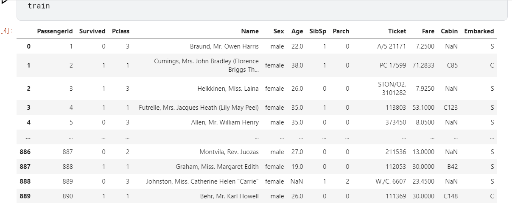


생존율 확인하는 코드 (default)

```python
women = train_data.loc[train_data.Sex == 'female']["Survived"]
rate_women = sum(women)/len(women)

print("% of women who survived:", rate_women)
```


## 시작


일단 Survived의 데이터를 기준으로 그룹을 나눈 뒤 두 데이터간의 차이를 확인해보자


#### 정수형의 수치 확인 


##### 1.Pclass

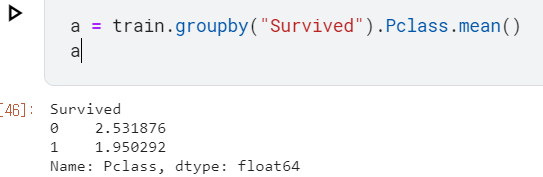


##### 2.Age

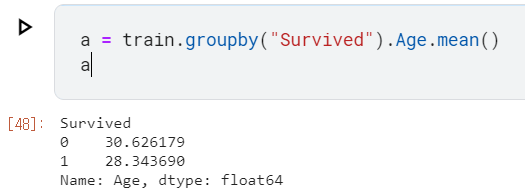


##### 3.SibSp

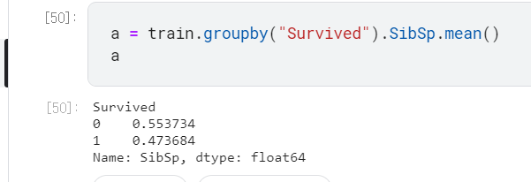


##### 4.Parch

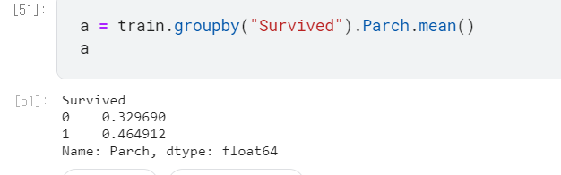


##### 5.Fare

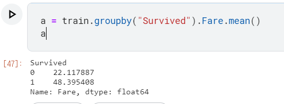


Fare쪽에서 유의미한 결과가 나온 것 같아서 바로 테스트 코드를 적용해보았다.


### 가설1 : 요금을 높게 낸 사람들은 생존 확률이 높을 것이다.

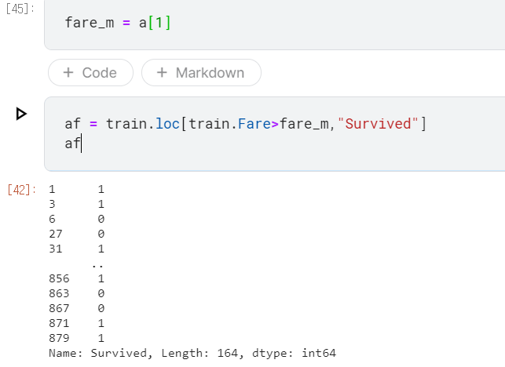


fare를 평균보다 더 낸 사람들의 집단을 정리해서 따로 DF를 생성하였다.


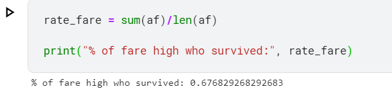


#### 결과는 약 67%가 생존


#### 참고 : 전체 생존율은 약 38%이다.

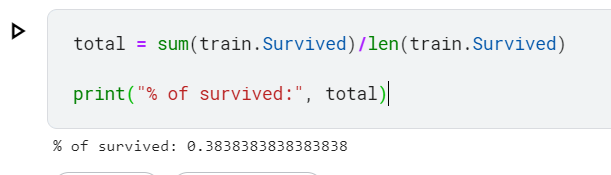


생존율이 약 1.75배가 늘었으므로, 꽤 유의미한 결과이다.

하지만 아직 다른 요소들이 있으므로 계속 분석을 진행해보자.


### 가설1-2 : 높은 가격을 낸 사람은 안전한 객실을 사용하였을 것이다.(구명조끼 같은 게 구비된?)


데이터 전처리 

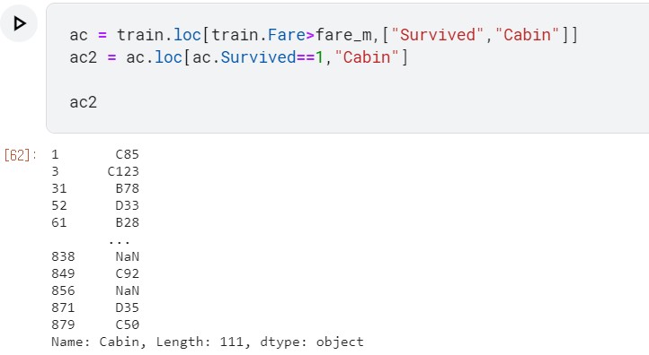


Fare를 높게 지불하고 살아남은 사람들의 객실번호를 저장


#### 생존을 한 사람들의 객실번호 :

```python
['C85',
 'C123',
 'B78',
 'D33',
 'B28',
 nan,
 'C23 C25 C27',
 'D10 D12',
 'C2',
 'E33',
 'B80',
 'D36',
 'D15',
 'C93',
 'C83',
 'D35',
 nan,
 'B77',
 nan,
 'C125',
 'C99',
 'D7',
 nan,
 'B49',
 'B58 B60',
 'C22 C26',
 nan,
 'C65',
 'E36',
 'C54',
 'B57 B59 B63 B66',
 'C7',
 'E34',
 'C32',
 'B18',
 nan,
 'E40',
 'C23 C25 C27',
 'E33',
 'D37',
 'B35',
 'E50',
 nan,
 nan,
 nan,
 'B96 B98',
 'D36',
 'C78',
 'B96 B98',
 'A34',
 'C92',
 'D21',
 'B49',
 'C93',
 'D20',
 'B79',
 nan,
 nan,
 'B73',
 'B18',
 nan,
 'B39',
 'B22',
 'C70',
 'E67',
 'C101',
 'E44',
 'C68',
 'E68',
 'B41',
 'D20',
 'A20',
 'C125',
 nan,
 'D19',
 'D9',
 'B35',
 nan,
 'D33',
 nan,
 'C126',
 'B51 B53 B55',
 'D49',
 'B5',
 'B20',
 nan,
 'C62 C64',
 nan,
 'C90',
 'C126',
 'C45',
 'E8',
 'B5',
 'B101',
 'B57 B59 B63 B66',
 nan,
 'B77',
 'B96 B98',
 'D11',
 'B3',
 'B20',
 'B96 B98',
 'E8',
 'B69',
 'B28',
 'E49',
 nan,
 'C92',
 nan,
 'D35',
 'C50']
```


사망을 한 사람의 객실 번호

```python
6              E46
27     C23 C25 C27
34             NaN
35             NaN
54             B30
62             C83
72             NaN
92             E31
102            D26
110           C110
118        B58 B60
120            NaN
124            D26
137           C123
139            B86
155            NaN
159            NaN
169            NaN
180            NaN
185            A32
201            NaN
245            C78
262            E67
297        C22 C26
324            NaN
332            C91
336             C2
373            NaN
377            C82
385            NaN
434            E44
438    C23 C25 C27
475            A14
493            NaN
498        C22 C26
505            C65
527            C95
544            C86
557            NaN
655            NaN
659            D48
665            NaN
671            B71
698            C68
741            C46
745            B22
748            D30
789        B82 B84
792            NaN
826            NaN
846            NaN
863            NaN
867            A24
Name: Cabin, dtype: object
```


딱히 큰 특징은 없어보이지만 일단 사망자 객실번호에 NaN이 많은 것이 신경쓰인다.


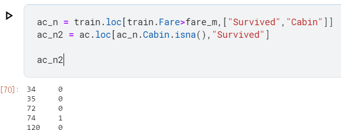


혹시나해서 일단 isna로 확인

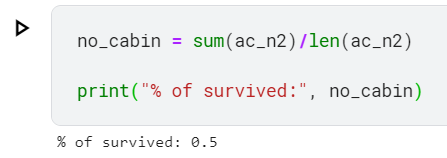


음... 그다지 의미있어보이진 않는다.


#### 하다가 뭔가 좀 너무 노가다 같아서 다른 알고리즘 풀이를 찾아봄. 

#### -> 의사결정나무로 

