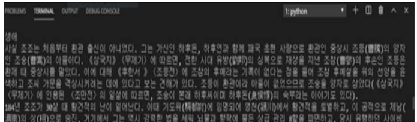

## 목차

### 1. 의사결정나무와 로지스틱 회귀분석을 활용한 타이타닉 생존자 예측

###  (2021.05~2021.06 / Python)

​    

### 2. Naive bayes를 활용한 네이버 댓글 긍부정 분석기

### (2019.12~2020.05 / Python)

​      

### 3. 위키피디아 API를 활용한 마인드맵 사이트

### (2019.11 ~2019.12 / Python, HTML, CSS, JAVAScript)

​         

### 4. 블로그 검색 API를 활용한 언급 빈도 시각화

### (2019.09 / R) 

### 5. 상권분석 API를 활용한 매물 클라우드 펀딩 플랫폼

### (2019.06 / Oracle , Java, Spring, Html, CSS) 

### 6. 트위터 API를 활용한 관광지 검색 데이터 수집

### (2017.06 / Python) 

​       

   

### 7. 야구 선수 데이터의 점수화를 통한 스카우팅 분석

### (2015.12 / R, Oracle)

​         

​        

​                    

## 1. 의사결정나무와 로지스틱 회귀분석을 활용한 타이타닉 생존자 예측

 

[ 개인, Kaggle Competition에서 도전한 프로젝트 ]) 

https://www.kaggle.com/c/titanic/submissions

위 링크에서 도전해본 타이타닉 생존자 데이터를 이용한 결과 값 예측 프로젝트이다.

 

상세 내용은 아래 Git Link에 정리

[https://github.com/Q3333/Study_Project/tree/master/Project%20-%20Titanic%20prediction](https://github.com/Q3333/Study_Project/tree/master/Project - Titanic prediction)

  

​                     

​                        

#### 1-1.      첫 시도는 Kaggle 튜토리얼을 통해 배운 Pandas 조작으로 그룹핑을 해서 의미 있는 column을 찾아 보았다.

  

​                       

​                        

 

####  1-2. 두 번째는 의사결정나무를 활용해서 생존 여부를 예측해 보았다.

 

​                      

​                        

  

####  1-3. 마지막으로 target과 train을 나누는 과정에서 영감을 얻어서 로지스틱 회귀 분석을 시도했다.

  

 

​                      

​                        

#### 각각의 Score는 로지스틱이 76, 의사결정 나무가 77점이 나왔다.

 

​                      

​                                             

​                                             

​                                             

​                        

  

 

## 2. Naive bayes를 활용한 네이버 댓글 긍부정 분석기

 

[ 개인, 책을 통해 공부를 하면서 만들어 본 프로젝트 ])

 

전체 과정은 https://github.com/Q3333/Study_Project

 

​                      

​                        

#### 2-1  유저에게 기사 URL과 학습 데이터의 개수를 입력 받음

   

​                     

​                        

#### 2-2  유저가 학습데이터의 긍,부정 여부를 판단

 

​                     

​                        

#### 2-3   형태소 분석 후 학습된 데이터를 바탕으로 단어의 긍,부정 여부를 판단

​                      

​                        

#### 2-4   결과

 

​                      

​                        

@ 긍,부정의 비율이 어느 한 쪽이 치우쳐진 기사일 경우에는 다른 한쪽의 학습 데이터가 부족해져서 전체 학습데이터의 양을 늘려야 할 것 같다.

 

​                      

​                                             

​                                             

​                        

 

## 3. 위키피디아 API를 활용한 마인드맵 사이트

 

[ 4인, 멀티캠퍼스 최종 프로젝트 ])

역할 : 데이터 수집, 전처리, 제공 및 전체적인 기능 개발 

 

전체 내용 : https://github.com/Q3333/Ask_and_Wiki_2019_12

​                      

​                        

####  3-1 위키피디아 API에서 텍스트 데이터 추출

​                     

​                        

####  3-2 서브섹션이 있는 경우 TF-IDF를 통해 주요 단어를 추출

​                     

​                        

#### 3-3 TF-IDF 분석된 값 중 가장 연관성이 높은 단어들을 마인드맵으로 뿌려줌

 

​                      

​                                             

​                                             

​                        

## 4. 네이버 블로그 검색 API를 활용한 언급 빈도 시각화

 

[ 개인, 멀티캠퍼스에서 배운 R을 이용해 네이버 블로그 검색 API의 결과를 워드클라우드로 시각화 ])

 

 

결과 : 

#### 주요 코드 : 

##### 키워드 설정, 조회 개수 설정, 네이버 API 연동

 

##### 데이터 전처리, 워드클라우드 출력

## 5. 상권분석 API를 이용한 데이터 시각화

 

[ 5인, 멀티캠퍼스에서 만난 분들과 참여한 해커톤 프로젝트 ])

역할 : 수집된 데이터 분석 및 시각화 및 전체적인 웹 개발

 

전체 프로젝트에 관한 정리는 https://github.com/Q3333/hackathon_2019_06

 

전체 프로젝트는 웹 플랫폼 개발이었는데, 그 중 상권 분석의 4지표를 보기 쉽게 제공하는 방법이 뭘까 고민을 하다가 전체 동네의 평균과 최대값, 최소값을 구한 뒤 해당 점포의 위치와 비교를 하여 나온 차이만큼 점수화 하여 별점으로 보여 주었다.

 

## 6. 트위터 API를 활용한 관광지 검색 데이터 수집

[ 개인, 학부 Python 수업에서 배운 내용을 토대로 데이터 크롤링 ])

#### 트위피 라이브러리를 사용한 주요 코드

  

#### 결과 화면

 

수집 키워드는 ['관광','여행','갔다옴','갔는데','다녀옴']) 이었고, 관광지 이름들을 변수로 언급 될 때 마다 카운팅 되는 식으로 구현하였다.

 

## 7. 야구 선수 데이터의 점수화를 통한 스카우팅 분석

 

[ 2인, 데이터베이스(SQL) 수업 마무리 프로젝트 ] )

역할 : 데이터 수집 및 분석과 아이디어 제안

 

 

#### R을 이용한 상관관계 분석과 데이터베이스 수치들을 이용한 점수화

홈런 , 타점의 상관관계 오른쪽 위 방향으로 정비례 한다는 걸 보여준다.

이러한 분석과 비슷한 상관관계 분석을 수 차례 진행한 내용을 바탕으로 기록들을 6가지로 분류하고 그룹핑해서 점수화.

#### 점수화 과정

##### 

#### 점수화를 이용한 선수 검색

 