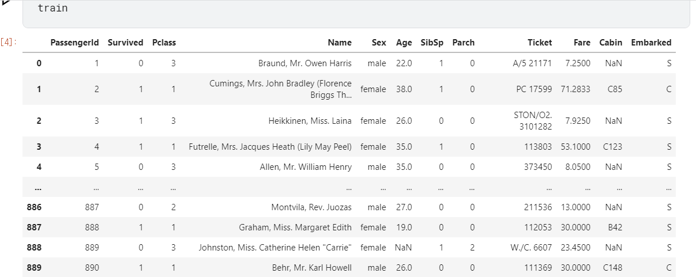

# 타이타닉 생존 예측하기


Kaggle에서 진행하는 오픈 데이터셋으로 타이타닉 생존자들의 데이터를 분석하고, 생존에 영향을 끼친 요인을 조사하는 프로젝트

https://www.kaggle.com/c/titanic/


시작하기 전에 column의 이름들을 미리 정리하자면

**pclass** : 티켓 클래스 (1,2,3)

**sibsp** : 형제자매, 배우자의 수 (of siblings / spouses aboard the Titanic)

**parch** : 부모,자식의 수 (of parents / children aboard the Titanic)

**cabin** : 객실 번호 (Cabin number)

**embarked** : 탑승지 (Port of Embarkation)


## 준비 (데이터 확인, 계획 세우기) 

파이썬 시작 import 코드(default)

```python
# This Python 3 environment comes with many helpful analytics libraries installed
# It is defined by the kaggle/python Docker image: https://github.com/kaggle/docker-python
# For example, here's several helpful packages to load

import numpy as np # linear algebra
import pandas as pd # data processing, CSV file I/O (e.g. pd.read_csv)

# Input data files are available in the read-only "../input/" directory
# For example, running this (by clicking run or pressing Shift+Enter) will list all files under the input directory

import os
for dirname, _, filenames in os.walk('/kaggle/input'):
    for filename in filenames:
        print(os.path.join(dirname, filename))

# You can write up to 20GB to the current directory (/kaggle/working/) that gets preserved as output when you create a version using "Save & Run All" 
# You can also write temporary files to /kaggle/temp/, but they won't be saved outside of the current session
```


각 데이터 할당하기

```python
train = pd.read_csv("/kaggle/input/titanic/train.csv")
test = pd.read_csv("/kaggle/input/titanic/test.csv")
gender = pd.read_csv("/kaggㅉle/input/titanic/gender_submission.csv")
```


train의 데이터는 이렇게 생겼다




## 시작 - 전처리


일단 Survived의 데이터를 의사결정나무에 적용하기 쉽게 전처리를 해주자


#### 컬럼 제거

```python
train = train.drop(['Name','Ticket','Cabin'],axis=1)
```

긴 문자열 데이터는 필요가 없을 것 같아서 삭제


#### 정수 데이터 전환

```python
train.loc[train["Sex"] == "male", "Sex"] = 0 
train.loc[train["Sex"] == "female", "Sex"] = 1
train.loc[train["Embarked"] == "S", "Embarked"] = 0
train.loc[train["Embarked"] == "C", "Embarked"] = 1
train.loc[train["Embarked"] == "Q", "Embarked"] = 2
```


#### 널값 치환

```python
train.Embarked.unique()
train.Age.isnull().sum()

train.Age = train.Age.fillna(train.Age.mean())
train.Embarked = train.Embarked.fillna(3)
```


전처리 된 결과 :


## 의사결정나무 - target 변수와 feature 변수 나누기


#### Pclass~Embraked 항목을 feature로

```python
feature_names = ["Pclass", "Sex", "Age",
                 "SibSp", "Parch", "Fare", "Embarked"]
```

```python
X_train = train[feature_names]

print(X_train.shape)
X_train.head()
```


#### Survived를 target으로 설정

```python
label_name = "Survived"

y_train = train[label_name]

print(y_train.shape)
y_train.head()
```


#### 트리 학습

트리에 각각 학습 데이터들을 적용시키고, 너무 깊은 트리가 되기 때문에 깊이를 5로 설정해주었다.

```python
from sklearn.tree import DecisionTreeClassifier
model = DecisionTreeClassifier(max_depth=5)
model.fit(X_train, y_train)
```


#### 그래프 그리기

```python
from sklearn.tree import export_graphviz
import graphviz

export_graphviz(model,
                feature_names=feature_names,
                class_names=["Die", "Survived"],
                out_file="decision-tree.dot")

with open("decision-tree.dot") as f:
    dot_graph = f.read()
    
graphviz.Source(dot_graph)
```


나무가 난잡하게 만들어지긴 했지만 모델 학습은 끝났으니, 테스트 데이터를 전처리한 뒤, 모델에 적용시키면 된다.


## 테스트 데이터 전처리


```python
test.loc[test["Sex"] == "male", "Sex"] = 0 
test.loc[test["Sex"] == "female", "Sex"] = 1
test = test.drop(['Name','Ticket','Cabin'],axis=1)
test.loc[test["Embarked"] == "S", "Embarked"] = 0
test.loc[test["Embarked"] == "C", "Embarked"] = 1
test.loc[test["Embarked"] == "Q", "Embarked"] = 2
test.Age = test.Age.fillna(test.Age.mean())
test.Embarked = test.Embarked.fillna(3)
test.Fare = test.Fare.fillna(test.Fare.mean())
```


## 테스트 데이터가 적용된 csv파일 만들기


```python
X_test = test[feature_names]
prediction = model.predict(X_test)
gender["Survived"] = prediction
print(gender.shape)
gender.head()
```


기존에 있던 csv파일 gender에 값을 덮어쓰기 했다.


## csv제출 


```python
gender.to_csv("finish.csv", index=False)
```


## 마무리


의외로 간단한 것 같아서 그냥 무턱대고 Survived를 그룹화해서 영향을 주는 요인을 찾으려고 했는데... 생각해보니 모델을 만들고 학습을 시켜야 할 것 같아서 알고리즘을 고민해보다가 의사결정나무를 찾게 되었다.


근데 막상 해보니 요인이 여러개에다가, 문자열로 되어있는 데이터는 전처리를 해줘야하고... 널 값이 있으면 작동을 안하고, 모델의 내부가 어떻게 생긴지 head같은 함수로 볼 수 도 없어서 많이 애먹었다.


의사결정나무 같은 알고리즘들을 많이 써봐야 익숙해지려나...


일단 캐글에서는 77점을 받았다.


그냥 인터넷에 있는 코드를 이해하고 적용하는데도 어려웠고, kaggle notebook에서 install을 하기 위해선 internet옵션을 허용 해야하는 것도 몰라서 힘들었다. 

