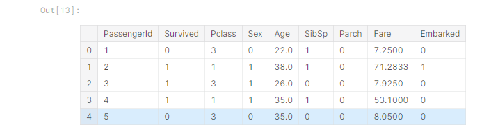
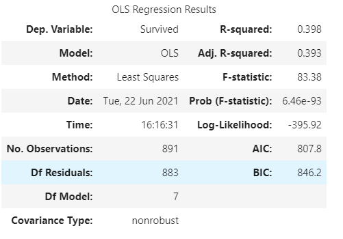
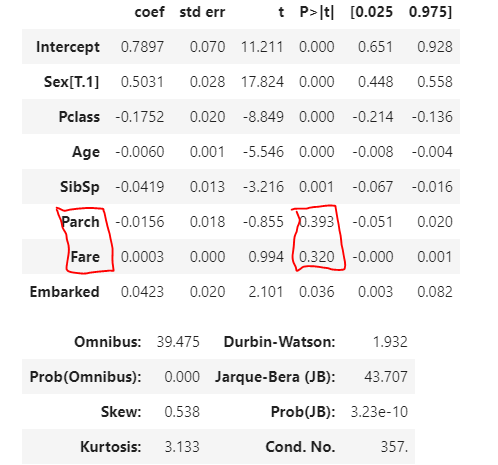
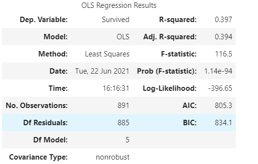
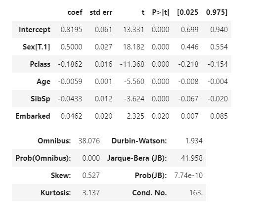

# 타이타닉 생존 예측하기2 - 로지스틱 회귀분석


시작 과정은 및 데이터 설명은 1참고,


의사결정나무를 활용하고 난 뒤, 다른 방법도 가능하지 않을까 고민을 해보다가 회귀분석이 떠올랐다.


로지스틱 회귀분석의 경우 종속변수가 0 또는 1이라서 Survived가 0이나1 인 이 분석에 적합하다고 생각했고 실행에 옮겨봤다.


## 시작 - 전처리


의사결정 나무 전처리때와 같음


#### 컬럼 제거

```python
train = train.drop(['Name','Ticket','Cabin'],axis=1)
```

긴 문자열 데이터는 필요가 없을 것 같아서 삭제


#### 정수 데이터 전환

```python
train.loc[train["Sex"] == "male", "Sex"] = 0 
train.loc[train["Sex"] == "female", "Sex"] = 1
train.loc[train["Embarked"] == "S", "Embarked"] = 0
train.loc[train["Embarked"] == "C", "Embarked"] = 1
train.loc[train["Embarked"] == "Q", "Embarked"] = 2
```


#### 널값 치환

```python
train.Embarked.unique()
train.Age.isnull().sum()

train.Age = train.Age.fillna(train.Age.mean())
train.Embarked = train.Embarked.fillna(3)
```


전처리 된 결과 :




## 로지스틱 회귀분석 - 변수선택(유의확률을 기반으로)


#### train 데이터에서 종속변수를 Survived로 두고, Pclass부터  Embarked까지의 모든 변수를 넣은 모형을 확인

```python
import statsmodels.api as sm

reg = sm.OLS.from_formula("Survived ~ Pclass + Sex + Age + SibSp + Parch + Fare + Embarked", train).fit()
reg.summary()
```








#### 유의확률이 0.05보다 높은 두 변수를 제거하고 다시 확인

```python
reg = sm.OLS.from_formula("Survived ~ Pclass + Sex + Age + SibSp + Embarked", train).fit()
reg.summary()
```






이제 모든 변수가 통계적으로 유의미하게 설정되었다.


이 5개의 변수를 활용해서 로지스틱 회귀모형을 만들 것 이다.


## 학습 데이터 생성

```python
feature_names = ["Pclass", "Sex", "Age",
                 "SibSp", "Embarked"]
```


위의 변수 선택과정에서 유의미 했던 변수들을 선택


```python
x_train = train[feature_names]

print(x_train.shape)
x_train.head()
```


```python
label_name = "Survived"

y_train = train[label_name]

print(y_train.shape)
y_train.head()
```


y를 Survived

x를 feature_names의 컬럼들로 설정했다.


## 로지스틱 모델 학습

로지스틱 회귀모형에 각각 학습 데이터들을 적용시킴

```python
from sklearn.linear_model import LogisticRegression
logreg = LogisticRegression()
logreg.fit(x_train, y_train)
```


## test 데이터 전처리

```python
test.loc[test["Sex"] == "male", "Sex"] = 0 
test.loc[test["Sex"] == "female", "Sex"] = 1
test = test.drop(['Name','Ticket','Cabin'],axis=1)
test.loc[test["Embarked"] == "S", "Embarked"] = 0
test.loc[test["Embarked"] == "C", "Embarked"] = 1
test.loc[test["Embarked"] == "Q", "Embarked"] = 2
test.Age = test.Age.fillna(test.Age.mean())
test.Embarked = test.Embarked.fillna(3)
test.Fare = test.Fare.fillna(test.Fare.mean())
```


## 로지스틱 모형으로 값 예측


```python
x_test = test[feature_names]
y_pred = logreg.predict(x_test)
y_pred
```


```python
gender["Survived"] = y_pred
print(gender.shape)
gender.head()
```


## 테스트 데이터가 적용된 csv파일 만들기


```python
gender.to_csv("finish_regression_3.csv", index=False)
```


기존에 있던 csv파일 gender에 값을 덮어쓰기 했다.


## 마무리


의사결정나무의 점수가 77.5 였기 때문에, 더 나은 방법이 없을까 생각을 해보다가... 시도해본 로지스틱인데


결과로만 말하자면 점수가 더 안 좋아졌다...ㅋㅋ ㅠㅠ


비슷하긴 한데... 그래도 이유가 뭔지 모르니 답답하다


변수 선택 과정에서 문제가 있었던 것 인지... 아니면 그냥 전처리부터 잘못된건지


단순 정렬이나 예측이 아니라 분석 알고리즘을 사용해서 분석을 하는 게 이리 어려울줄이야